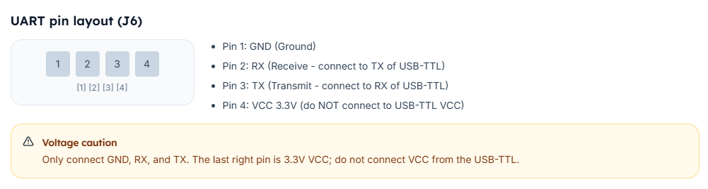
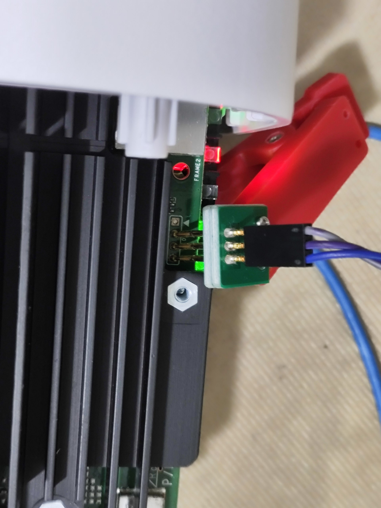
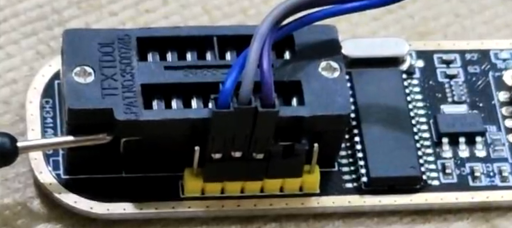
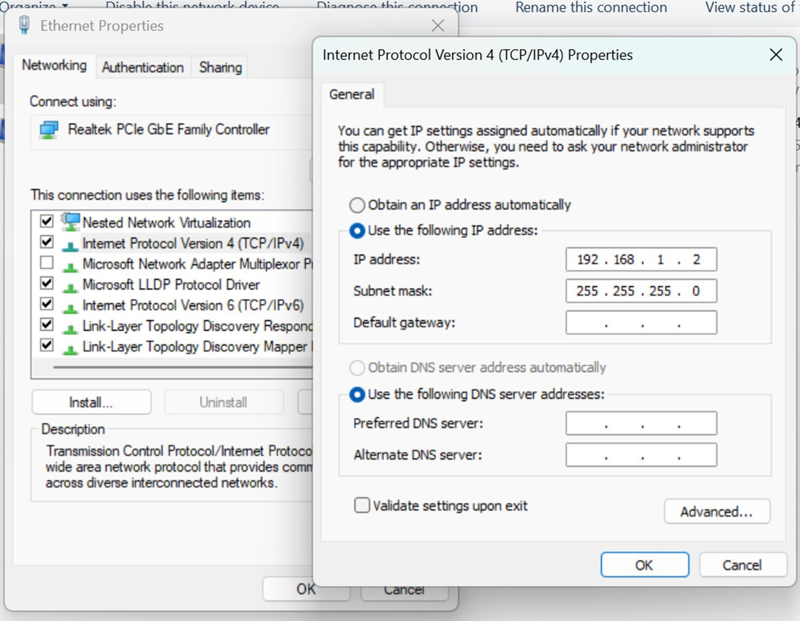
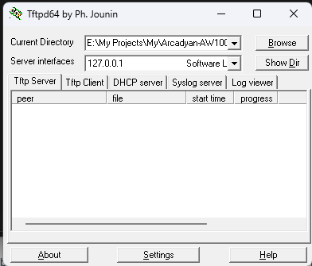
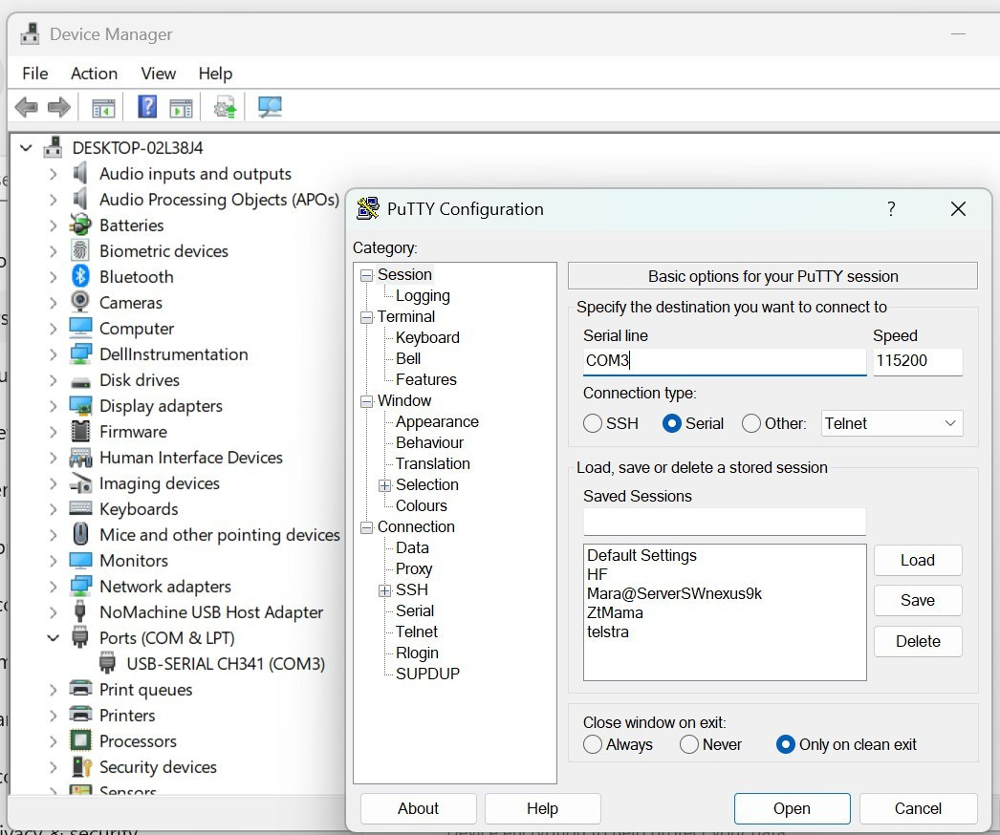

# Arcadyan UART Quick Guide

## What is a UART Device?

UART (Universal Asynchronous Receiver-Transmitter) is a device or software for serial communication between two devices, such as a computer and a modem. It is commonly used for:

- Debugging
- Configuration
- Firmware updates

## What You Need

### Hardware

- USB-to-serial adapter (CP2102, CH340, or similar)
- RJ45 cable
- Jumper wires for connecting to UART pins

### Software

- **PuTTY** (or any terminal emulator)
- **TFTP server** (for firmware transfers)

## What is a UART Session Using Serial Console?

A UART session via serial console is a direct connection between your laptop and a modem using a serial cable (USB to TTL, RJ45 Console, or Micro-USB). It provides access to the CLI (Command Line Interface) for configuration and troubleshooting.

## Connection Method

### 1. Connect Laptop to Modem

Connect your USB-to-serial adapter to the UART pins on the modem using the following wiring:

| Adapter Pin | Modem Pin |
| ----------- | --------- |
| GND         | GND       |
| RX          | TX        |
| TX          | RX        |

**Pinout Diagram:**

**Modem Connections:**

**USB-to-Serial Adapter Connections:**

> **Note:** Cross the TX and RX connections - adapter RX connects to modem TX, and adapter TX connects to modem RX.

### 2. change network settings as following

- IP Address: 192.168.1.2
- Subnet Mask: 255.255.255.0
- Default Gateway: 192.168.1.1

**Network Settings Screenshot:**

### 3. Download the content of the resource folder and install tftp server and then start it and select the resource folder

**TFTP Server Settings Screenshot:**

### 4. Configure Terminal Software

Using **PuTTY** (or similar terminal emulator):

1. Find your COM port in **Device Manager** (Windows) or `/dev/ttyUSB*` (Linux)
2. Configure the following settings:
   - **Connection Type:** Serial
   - **Serial Line:** COM port number (e.g., COM3)
   - **Speed :** 115200

**PuTTY Configuration Screenshot:**

### 5. Access the Modem

Once connected successfully, you will have access to the CLI where you can:

- Execute debug commands
- Change device settings
- Restore or update firmware

## Common Speeds

| Device Model    | Speed  |
| --------------- | ------ |
| Arcadyan AW1000 | 115200 |

### 6. Command list

    -  tftpboot aw1000-mibib.bin
    -  flash 0:MIBIB
    -  tftpboot factory.bin
    -  flash rootfs

**Default Credentials:**

- **Username:** root
- **Password:** password

## Troubleshooting

- **Connect and power on device it will show output on terminal**
- **No response in terminal:** Check that TX/RX are properly crossed and GND is connected
- **Garbled text:** Verify the speed matches your device (usually 115200)
- **COM port not found:** Install the appropriate USB-to-serial driver (CP2102 or CH340)

## Safety Warning

⚠️ **Warning:** Modifying firmware or settings via UART can brick your device if done incorrectly. Proceed with caution.

## License

This guide is provided as-is for educational purposes.

## Contributing

Feel free to submit issues or pull requests if you have improvements or corrections.
